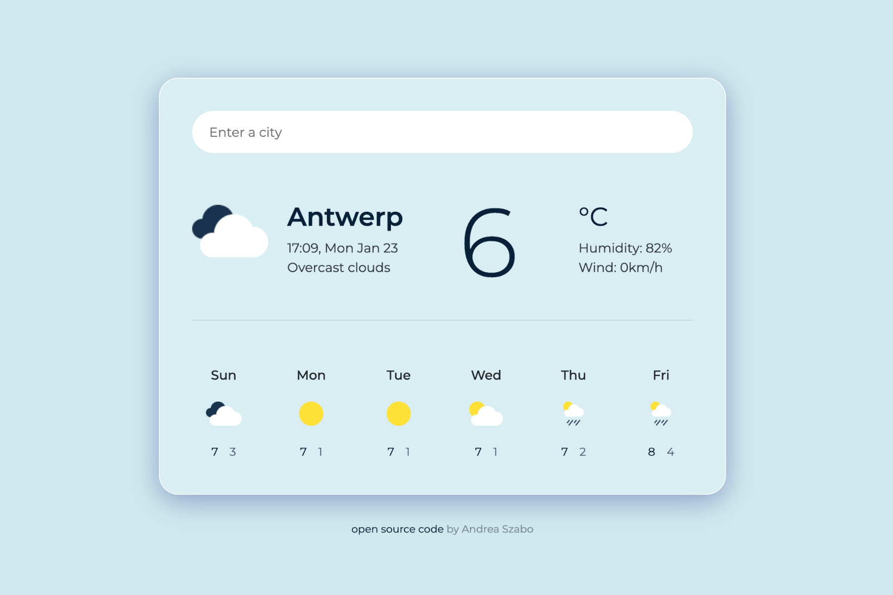

# Weather App Backlog

Last updated : Tues 19, November

## Installation

### Basic

- [x] Vite and React installation in Typescript

```bash
pnpm install vite
```

- [x] Push on github and link of the repo
      <https://github.com/florianrumigny/training-weather-app>

- [ ] Install antfu package eslint configuration  
       Not working with Vite : how to use both ?

- [ ] Think to push frequently

## Features

### Static components

- [ ] Create static components

  - [ ] one page component layout

    - [ ] create the global layout
    - [ ] create a search bar to search city
    - [ ] create a card for a city with temp, image etc. (and define the data we want)
    - [ ] do a function for the search bar to display real name in real time ?
    - <https://app.swaggerhub.com/apis-docs/WeatherAPI.com/WeatherAPI/1.0.2#/APIs/search-autocomplete-weather> : API gives us an endpoint to autocomplete directly / with onChange of react maybe ?

  - [ ] Structure in multiple components if necessary
  - [ ] Create a generic type for the data (data: city)
  - [ ] Install Zustand and create store to manage props

### Dynamic components

- [ ] Manage and create the function in the store to call the API
- [ ] Manage the data with TypeScript type
- [ ] A function to dynamically render some icons (sun, rainy, etc) for each case

## Design



- [ ] Layout Global

  - [ ] Css layout homepage
    - [ ] Just on card for the moment and a dynamic search for the city
  - [ ] Follow BEM for naming class
  - **Note:**

    - Block: Represents a top-level abstraction of a component (e.g., .button, .card).
    - Element: Represents a part of a block (e.g., .button**icon, .card**header).
    - Modifier: Represents a variant or state of a block or element (e.g., .button--primary, .card\_\_header--large).

  - [ ] Do a slide to have multiple card and go to it

- [ ] Responsive Layout
  - [ ] Homepage lisible on screen
